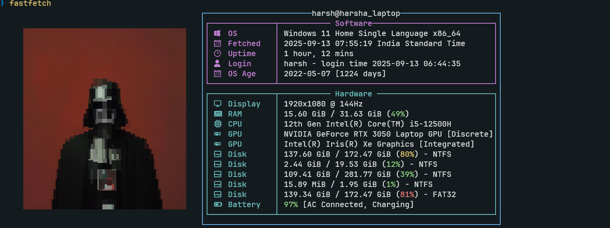
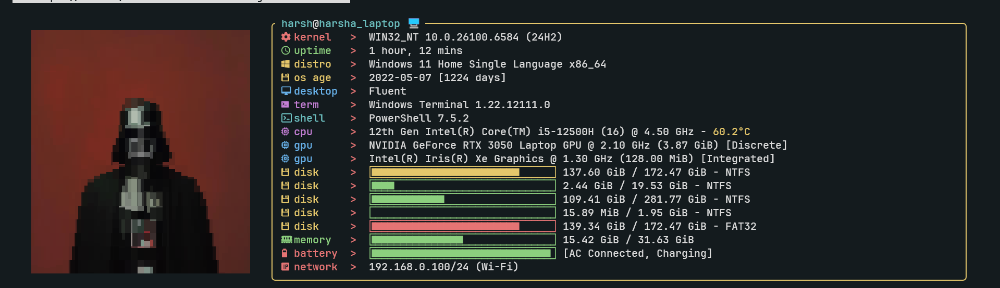

# Fastfetch Configs

This repository contains my custom configuration files for Fastfetch, a command-line tool for displaying system information in a stylish way. These configs are tailored for my personal setup and can be used to customize the output of Fastfetch on your system.

## About the Configs

- The configuration files included here define how Fastfetch displays system information, colors, and layout.
- You can use these configs to quickly set up Fastfetch with my preferred style.

## Preview

Below are previews of my Fastfetch setup using these configs:

### Config 1 (config1.jsonc)

This config features a blue color scheme, custom separators, and a large ASCII logo.

**Config file location:** [`fastfetch/config.jsonc`](fastfetch/config.jsonc)

### Config 2 (config2.jsonc)

This config uses a red separator, a compact layout, and a custom progress bar style.

**Config file location:** [`fastfetch/config2.jsonc`](fastfetch/config2.jsonc)

The following images are available in the `fastfetch/imgs` folder. I use [chafa](https://github.com/hpjansson/chafa) to display these images in the terminal. All chafa-compatible images are stored in the `fastfetch/logos` directory.

## Usage

1. Copy the configuration files from this repository to your Fastfetch config directory.
2. Run Fastfetch to see the customized output.

---

Feel free to use or modify these configs for your own setup!
